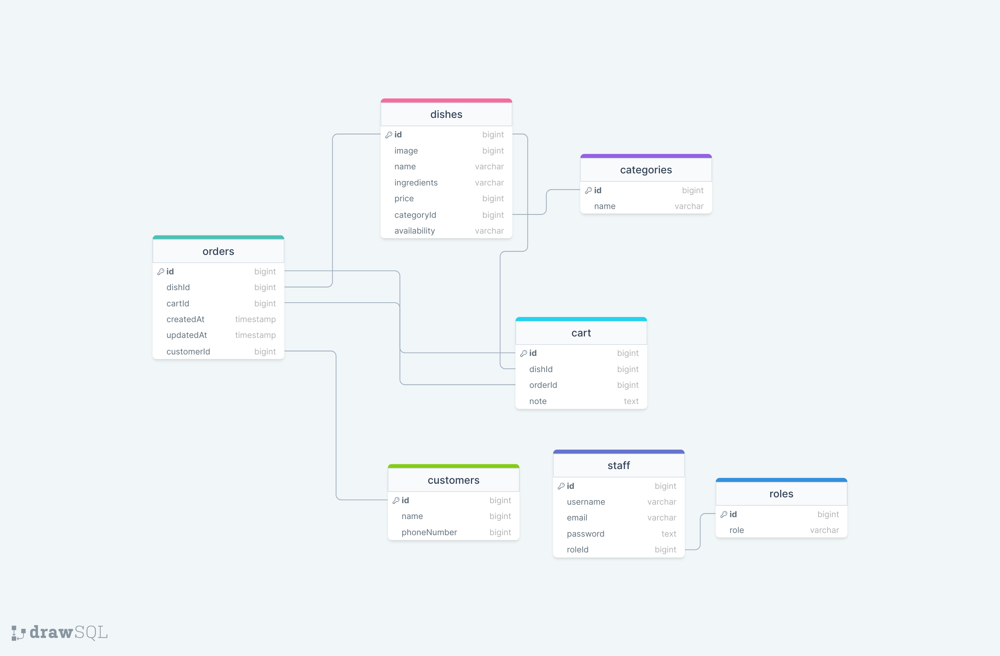

# Menu Mingle
our app allows clients to track restaurant orders. It provides an intuitive interface for placing orders, tracking their status, and managing the restaurant's menu.
## Table of Contents
- [Introduction](#Menu)
- [ UserStory ](#User)
- [ User Journey](#User)
- [Database Schema](#Database)
- [Technologies Used](#Technologies)
- [Demo](#Demo)
- [Figma Design](#Figma)
- [Contributing](#contributing)
- [Acknowledgements](#Acknowledgements)
# User Stories 
- As a user, I am going to do the following:
   - User registration and authentication for the staff.
   - Menu management for the restaurant.
   - Order placement by customers.
   - Real-time order tracking.
   - Notification system for order updates.
- As a member of the restaurant staff, my capabilities will depend on my role within the establishment. Here are the tasks I can perform based on different roles:
   - Admin dashboard for managing orders and menus.
   
### Wishlist features 
- Payment integration.
- Reporting and analytics.

# User Journey

I will open my camera program or QR scanner app to scan the QR code attached to each table. This will display the menu page, showing the name, ingredients, and price of each menu item. I can adjust the quantity of each item as desired and add them to my cart.

After selecting the desired items and adding them to my cart, I can review the contents of my cart. The cart will display the details of each selected item and its corresponding quantity. I can make changes to the quantities or remove items from my cart if needed.

Once I am satisfied with the items in my cart, I can proceed to the checkout process. At this point, I will be prompted to provide my payment information. The payment gateway will securely process my payment details, ensuring the confidentiality and integrity of my information.

After successfully completing the payment process, I will receive a confirmation of the transaction. The order will be sent to the kitchen for preparation, and the order status will be updated accordingly.

   - If I am the owner:
        I have the authority to manage the menu by adding new dishes, modifying existing ones, and removing items as needed. This can be done through the dashboard provided to me.

  - If I am a cook:
       I am responsible for receiving orders from the system and preparing the dishes accordingly. Once a dish is prepared, I can update its status to "done" in the system, indicating that it is ready for serving.

# Database Schema 
 

# Technologies Used
#### Front-end: 
- HTML, CSS, JavaScript
- React.js 
- Material UI
- WebSockets (for real-time updates)
#### Back-end:  
- Node.js
- Express.js 
- PostgresSQL with sequelize
- Socket.io (for real-time updates)
- JWT (JSON Web Tokens) for authentication
#### Deployment:
- RDS
- EC2

# Demo 🔥
You can check out a live demo of the application <a href='#'>here</a>.

# Figma Design 
#### customer :

    
 

#### staff :
  

 

# Contributing
Contributions are welcome! If you find any issues or have suggestions for improvements, feel free to open an issue or submit a pull request.

# coders 💻
#### team:
- @Farah202324
- @momenmarwan
- @momenqudaih

#### team leader
- @moustf
##### If you have any questions or need further assistance, please feel free to contact us.

# Acknowledgements
We would like to express our heartfelt appreciation to Gaza Sky Geeks for their unwavering commitment to building a brighter future for Gaza and its people. Thank you, GSG, for your dedicated efforts and tireless work in the Code Academy. It has been an absolute honor to be part of this remarkable community and collaborate with such talented individuals.

